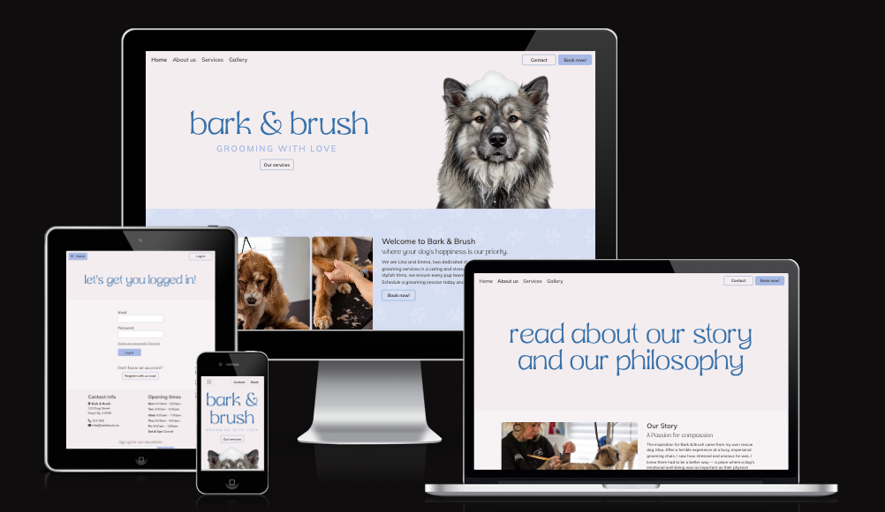
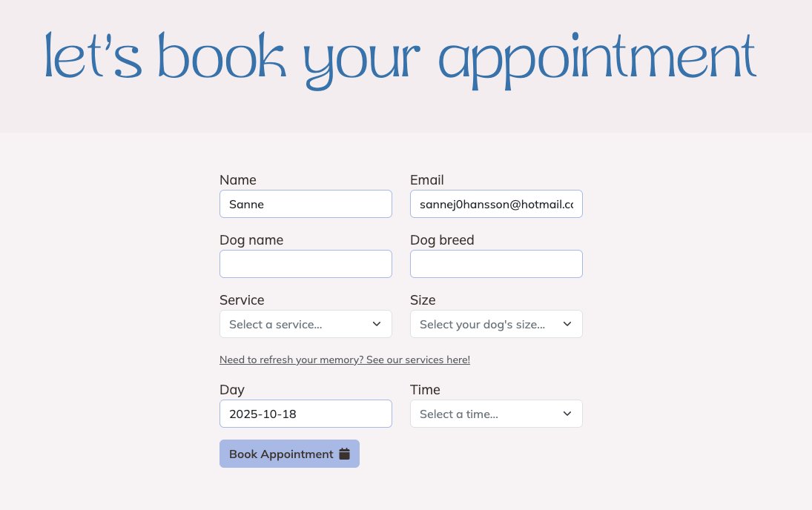
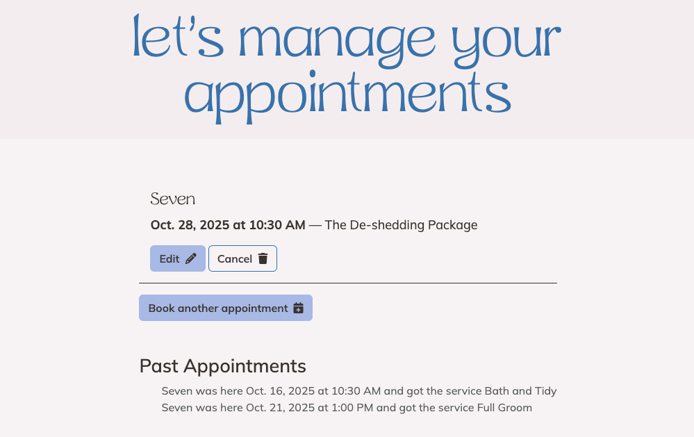
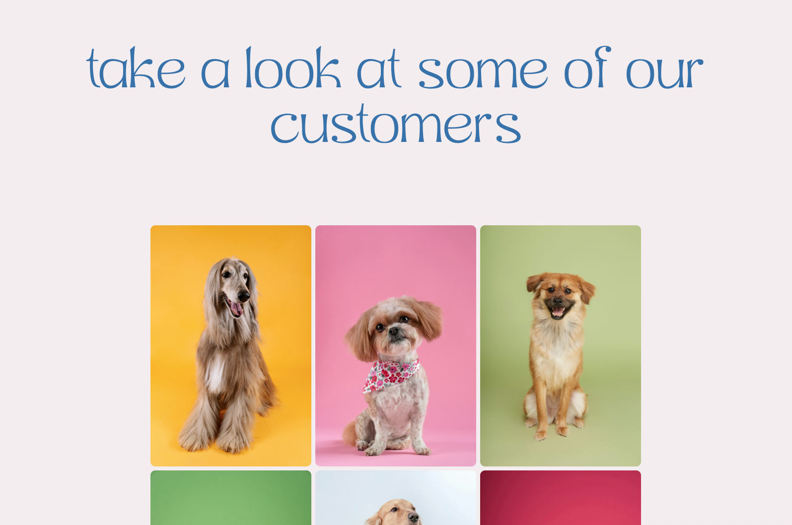
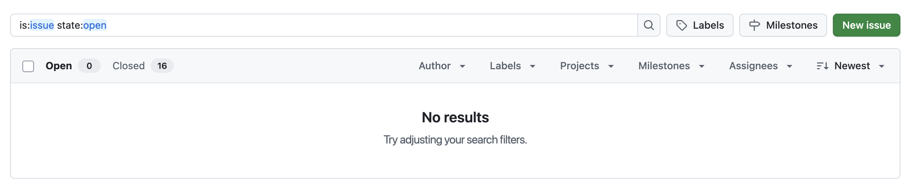
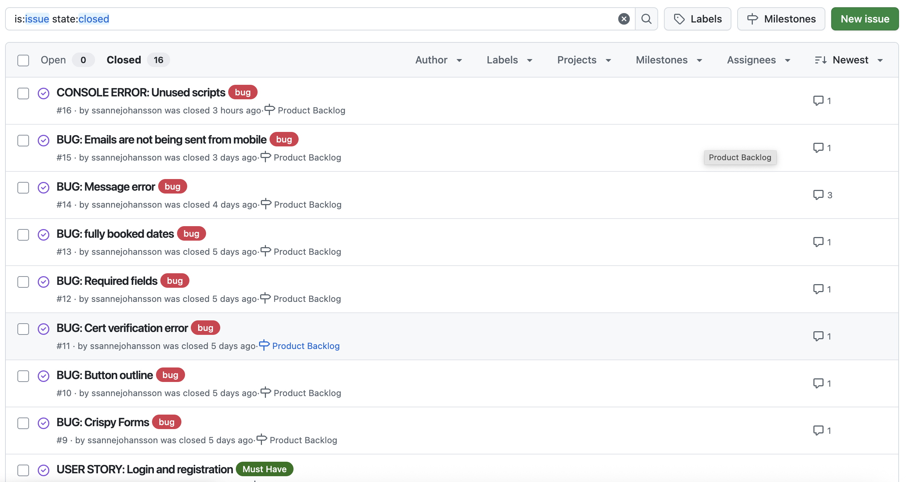

# MP3 - Bark and Brush
[Visit the live site here!](https://bark-and-brush-dba8d291cd80.herokuapp.com)

Developer: Sanne Johansson ([ssannejohansson](https://www.github.com/ssannejohansson))

[](https://www.github.com/ssannejohansson/MP3-bark-and-brush/commits/main)
[](https://www.github.com/ssannejohansson/MP3-bark-and-brush/commits/main)
[](https://www.github.com/ssannejohansson/MP3-bark-and-brush)
[](https://bark-and-brush-dba8d291cd80.herokuapp.com)


## Project Goals / Rationale 

As a dog owner whose pet dislikes grooming, I understand the importance of groomers who prioritize the comfort and well-being of the animals in their care. This inspired me to create a fictional grooming business centered on compassionate care — catering to dogs with special needs as well as those who are more easygoing.

The goal of this project was to design a visually appealing yet clean and intuitive website that fulfills user needs without unnecessary clutter.



source: [MP3-bark-and-brush amiresponsive](https://ui.dev/amiresponsive?url=https://bark-and-brush-dba8d291cd80.herokuapp.com/)


## UX

### The 5 Planes of UX

#### 1. Strategy

**Purpose**
- Provide dog owners with necessary information about the business and its services
- Offer users a simple booking system to book their appointments

**Primary User Needs**
- Business owner need to give their potential customers necessary information about the business and services and ability to manage bookings from an admin site. 
- Registered users need the ability to change and cancel their booked appointments. 
- Customers need the ability to browse the website and register if they want to book and appointment. 

**Business Goals**
- Simple, straight forward information about the business and its services. 
- Simple and clear user functionality to register, log in, book and manage appointments. 
- Ensure easy booking management for owners.

#### 2. Scope

**[Features](#features)** (see below)

**Content Requirements**
- Booking management (create, update, delete, and preview).
- User account features (register, log in, log out)
- 404 error page for lost users.

#### 3. Structure

**Information Architecture**
- **Navigation Menu**:
  - Links to Home, About, Services, Gallery, Contact and Booking. 

**User Flow**
1. Guest users browse website → read information and decides to book an appointment.
2. Guest users register for an account → log in to book an appointment.
3. Registered users book an appointment → are able to see their booking and edit/delete it.
4. Business owners can create, update, and manage appointments.


#### 4. Skeleton

**[Wireframes](#wireframes)** (see below)

#### 5. Surface

**Visual Design Elements**
- **[Colours](#colour-scheme)** (see below)
- **[Typography](#typography)** (see below)

### Colour Scheme
For the colour scheme, I browsed Instagram for inspiration, found one I liked, and modified it to suit a website.

I used [coolors.co](https://coolors.co/080708-3772ff-df2935-fdca40-e6e8e6) to generate my color palette.


### Typography

- [Marige Thin Font](https://www.fontspace.com/marige-thin-font-f148657) was used for the primary headers and titles.
- [Mulish](https://fonts.google.com/specimen/Mulish?query=mulisht) was used for all other secondary text.
- [Font Awesome](https://fontawesome.com) icons were used throughout the site, such as the social media icons in the footer and icons in buttons on booking pages.

## Wireframes

To follow best practice, wireframes were developed for mobile, tablet, and desktop sizes.
I've used [Balsamiq](https://balsamiq.com/wireframes) to design my site wireframes.

| Page |  |
| --- | --- |
| Home |  | 
| About |  
| Services |  | 
| Gallery|  | 
| Booking |  | 
| Contact Modal |  | 

## User Stories

| Target | Expectation | Outcome |
| --- | --- | --- |
| As a first time visitor | I would like to find a groomer | so that I can groom my dog |
| As first time visitor | I would like to know more about the groomers | so that I know if they will go along with my dog |
| As a first time visitor | I would like to know what services the groomers provide | so that I know if they will meet my requirements |
| As a first time visitor | I would like to look at images of previous customers | so that I can decide if I like their services |
| As a first time visitor | I would like to book an appointment | so that I can get my dog groomed |
| As a first time visitor | I would like to know the opening times | so that I can know if they suit me |
| As a returning customer | I would like to book an appointment | so that I can get my dog groomed |
| As a returning customer | I would like to get in touch with the groomers | so that I can ask potential questions |
| As a returning customer | I would like to sign up for a newsletter | so that I can get all the news from the business |
| As a frequent customer | I would like to book an appointment | so that I can get my dog groomed |
| As a business owner | I would like to have an admin site | so that I can manage bookings and users |
| As a business owner| I would like a responsive site with clear navigation that clearly communicates our services. | so that our customers will stay on our site |

## Features

### Existing Features

| Feature | Notes | Screenshot |
| --- | --- | --- |
| Register | Authentication is handled by authenticate, allowing users to register accounts. |  |
| Login | Authentication is handled by authenticate, allowing users to log in to their existing accounts. |  |
| Logout | Authentication is handled by authenticate, allowing users to log out of their accounts. |  |
| Password Reset | Authentication is handled by authenticate and PasswordResetForm allowing users to reset their password.|  |
| Booking | Users can book an appointment |  |
| Manage appointments | Users can manage their appointments |  |
| Update Appointment | Users can update and cancel their appointment |  |
| Account | Users can manage their account details |  |
| Contact Form | Users can contact the business using the contact form |  |
| Home Page | The Home page introduces the business |  |
| About Page | The About page displays information about the business |  |
| Services page | The Services page displays information about the business services |  |
| Gallery Page | The Gallery page displays a gallery of images of the business customers |  |
| 404 | The 404 error page will indicate when a user has navigated to a page that doesn't exist, replacing the default Heroku 404 page with one that ties into the site's look and feel. |  |


### Future Features
- A review section on the Home page, for registered users to add a review.
- A working newsletter.
- In a real-world product, the various booking packages and size options would require different processing times. To maintain a manageable project scope, I chose not to implement this functionality at this stage; however, I recognize it as an important enhancement for future development.

## Tools & Technologies

| Tool / Tech | Use |
| --- | --- |
| [](https://markdown.2bn.dev) | Generate README and TESTING templates. |
| [Git](https://git-scm.com) | Version control. (`git add`, `git commit`, `git push`) |
| [GitHub](https://github.com) | Secure online code storage. |
| [HTML](https://en.wikipedia.org/wiki/HTML) | Main site content and layout. |
| [CSS](https://en.wikipedia.org/wiki/CSS) | Design and layout. |
| [Javascript](https://www.javascript.com) | User interaction on the site. |
| [Python](https://www.python.org) | Back-end programming language. |
| [Heroku](https://www.heroku.com) | Hosting the deployed back-end site. |
| [Bootstrap](https://getbootstrap.com) | Front-end CSS framework for modern responsiveness and pre-built components. |
| [Django](https://www.djangoproject.com) | Python framework for the site. |
| [PostgreSQL](https://www.postgresql.org) | Relational database management. |
| [Balsamiq](https://balsamiq.com/wireframes) | Creating wireframes. |
| [Font Awesome](https://fontawesome.com) | Icons. |
| [GhatGPT](https://chat.openai.com) | Help debug, troubleshoot, and explain things. |
| [W3Schools](https://www.w3schools.com) | Tutorials/Reference Guide |
| [Gemini](https://gemini.google.com) | Create hero image for Home page. |
| [TinyPng](https://tinypng.com/) | To compress images |
| [Photoshop](https://photoshop.adobe.com/) | For editing images/logos and remove backgrounds. |
| [Namelix](https://namelix.com) | For business name. |
| [Instagram](https://www.instagram.com/) | For color scheme inspiration. |
| [Vecteezy](https://www.vecteezy.com/) | For favicon-logo. |
| [Favicon.io](Favicon.io ) | To generate favicon. |
| [Google Fonts](https://fonts.google.com/) | For fonts. |
| [Fontspace](https://www.fontspace.com/) | For fonts. |
| [Unsplash](https://unsplash.com/) | For images |
| [Pexels](https://pexels.com/) | For images |
|[Autoprefixer](https://autoprefixer.github.io/) | To make sure the code is working across browsers. |
| [Am I Responsive?](https://ui.dev/amiresponsive) | To show the website on all devices. |

## Database Design

### Data Model


## Agile Development Process

### GitHub Projects

[GitHub Projects](https://www.github.com/ssannejohansson/MP3-bark-and-brush/projects) served as an Agile tool for this project. Through it, EPICs, User Stories, issues/bugs, and Milestone tasks were planned, then subsequently tracked on a regular basis using the Kanban project board.


### GitHub Issues

[GitHub Issues](https://www.github.com/ssannejohansson/MP3-bark-and-brush/issues) served as an another Agile tool. There, I managed my User Stories and Milestone tasks, and tracked any issues/bugs.

| Link | Screenshot |
| --- | --- |
| [GitHub issues](https://github.com/ssannejohansson/MP3-bark-and-brush/issues) |  |
| [GitHub closed issues](https://github.com/ssannejohansson/MP3-bark-and-brush/issues?q=is%3Aissue%20state%3Aclosed) |  |

### MoSCoW Prioritization

I've decomposed my Epics into User Stories for prioritizing and implementing them. Using this approach, I was able to apply "MoSCoW" prioritization and labels to my User Stories within the Issues tab.

- **Must Have**: guaranteed to be delivered - required to Pass the project
- **Should Have**: adds significant value, but not vital 
- **Could Have**: has small impact if left out 
- **Won't Have**: not a priority for this iteration - future features

## Testing

> [!NOTE]  
> For all testing, please refer to the [TESTING.md](TESTING.md) file.

## Deployment

The live deployed application can be found deployed on [Heroku](https://bark-and-brush-dba8d291cd80.herokuapp.com).

### Heroku Deployment

This project uses [Heroku](https://www.heroku.com), a platform as a service (PaaS) that enables developers to build, run, and operate applications entirely in the cloud.

Deployment steps are as follows, after account setup:

- Select **New** in the top-right corner of your Heroku Dashboard, and select **Create new app** from the dropdown menu.
- Your app name must be unique, and then choose a region closest to you (EU or USA), then finally, click **Create App**.
- From the new app **Settings**, click **Reveal Config Vars**, and set your environment variables to match your private `env.py` file.

> [!IMPORTANT]  
> This is a sample only; you would replace the values with your own if cloning/forking my repository.

| Key | Value |
| --- | --- |
| `CLOUDINARY_URL` | user-inserts-own-cloudinary-url |
| `DATABASE_URL` | user-inserts-own-postgres-database-url |
| `DISABLE_COLLECTSTATIC` | 1 (*this is temporary, and can be removed for the final deployment*) |
| `SECRET_KEY` | any-random-secret-key |

Heroku needs some additional files in order to deploy properly.

- [requirements.txt](requirements.txt)
- [Procfile](Procfile)
- [.python-version](.python-version)

You can install this project's **[requirements.txt](requirements.txt)** (*where applicable*) using:

- `pip3 install -r requirements.txt`

If you have your own packages that have been installed, then the requirements file needs updated using:

- `pip3 freeze --local > requirements.txt`

The **[Procfile](Procfile)** can be created with the following command:

- `echo web: gunicorn app_name.wsgi > Procfile`
- *replace `app_name` with the name of your primary Django app name; the folder where `settings.py` is located*

The **[.python-version](.python-version)** file tells Heroku the specific version of Python to use when running your application.

- `3.12` (or similar)

For Heroku deployment, follow these steps to connect your own GitHub repository to the newly created app:

Either (*recommended*):

- Select **Automatic Deployment** from the Heroku app.

Or:

- In the Terminal/CLI, connect to Heroku using this command: `heroku login -i`
- Set the remote for Heroku: `heroku git:remote -a app_name` (*replace `app_name` with your app name*)
- After performing the standard Git `add`, `commit`, and `push` to GitHub, you can now type:
	- `git push heroku main`

The project should now be connected and deployed to Heroku!

### PostgreSQL

This project uses a [Code Institute PostgreSQL Database](https://dbs.ci-dbs.net) for the Relational Database with Django.

> [!CAUTION]
> - PostgreSQL databases by Code Institute are only available to CI Students.
> - You must acquire your own PostgreSQL database through some other method if you plan to clone/fork this repository.
> - Code Institute students are allowed a maximum of 8 databases.
> - Databases are subject to deletion after 18 months.

To obtain my own Postgres Database from Code Institute, I followed these steps:

- Submitted my email address to the CI PostgreSQL Database link above.
- An email was sent to me with my new Postgres Database.
- The Database connection string will resemble something like this:
    - `postgres://<db_username>:<db_password>@<db_host_url>/<db_name>`
- You can use the above URL with Django; simply paste it into your `env.py` file and Heroku Config Vars as `DATABASE_URL`.


### Local Development

This project can be cloned or forked in order to make a local copy on your own system.

For either method, you will need to install any applicable packages found within the [requirements.txt](requirements.txt) file.

- `pip3 install -r requirements.txt`.

You will need to create a new file called `env.py` at the root-level, and include the same environment variables listed above from the Heroku deployment steps.

> [!IMPORTANT]  
> This is a sample only; you would replace the values with your own if cloning/forking my repository.

Sample `env.py` file:

```python
import os

os.environ.setdefault("SECRET_KEY", "any-random-secret-key")
os.environ.setdefault("DATABASE_URL", "user-inserts-own-postgres-database-url")
os.environ.setdefault("CLOUDINARY_URL", "user-inserts-own-cloudinary-url")  # only if using Cloudinary

# local environment only (do not include these in production/deployment!)
os.environ.setdefault("DEBUG", "True")
```

Once the project is cloned or forked, in order to run it locally, you'll need to follow these steps:

- Start the Django app: `python3 manage.py runserver`
- Stop the app once it's loaded: `CTRL+C` (*Windows/Linux*) or `⌘+C` (*Mac*)
- Make any necessary migrations: `python3 manage.py makemigrations --dry-run` then `python3 manage.py makemigrations`
- Migrate the data to the database: `python3 manage.py migrate --plan` then `python3 manage.py migrate`
- Create a superuser: `python3 manage.py createsuperuser`
- Load fixtures (*if applicable*): `python3 manage.py loaddata file-name.json` (*repeat for each file*)
- Everything should be ready now, so run the Django app again: `python3 manage.py runserver`

If you'd like to backup your database models, use the following command for each model you'd like to create a fixture for:

- `python3 manage.py dumpdata your-model > your-model.json`
- *repeat this action for each model you wish to backup*
- **NOTE**: You should never make a backup of the default *admin* or *users* data with confidential information.

#### Cloning

You can clone the repository by following these steps:

1. Go to the [GitHub repository](https://www.github.com/ssannejohansson/MP3-bark-and-brush).
2. Locate and click on the green "Code" button at the very top, above the commits and files.
3. Select whether you prefer to clone using "HTTPS", "SSH", or "GitHub CLI", and click the "copy" button to copy the URL to your clipboard.
4. Open "Git Bash" or "Terminal".
5. Change the current working directory to the location where you want the cloned directory.
6. In your IDE Terminal, type the following command to clone the repository:
	- `git clone https://www.github.com/ssannejohansson/MP3-bark-and-brush.git`
7. Press "Enter" to create your local clone.

Alternatively, if using Ona (formerly Gitpod), you can click below to create your own workspace using this repository.

[](https://gitpod.io/#https://www.github.com/ssannejohansson/MP3-bark-and-brush)

**Please Note**: in order to directly open the project in Ona (Gitpod), you should have the browser extension installed. A tutorial on how to do that can be found [here](https://www.gitpod.io/docs/configure/user-settings/browser-extension).

#### Forking

By forking the GitHub Repository, you make a copy of the original repository on our GitHub account to view and/or make changes without affecting the original owner's repository. You can fork this repository by using the following steps:

1. Log in to GitHub and locate the [GitHub Repository](https://www.github.com/ssannejohansson/MP3-bark-and-brush).
2. At the top of the Repository, just below the "Settings" button on the menu, locate and click the "Fork" Button.
3. Once clicked, you should now have a copy of the original repository in your own GitHub account!

### Local VS Deployment

There are no remaining major differences between the local version when compared to the deployed version online.

## Credits

### Content

| Source | Notes |
| --- | --- |
| [Markdown Builder](https://markdown.2bn.dev) | Help generating Markdown files |
| [Geeks for Geeks](https://www.geeksforgeeks.org/python/setup-sending-email-in-django-project/) | "Setup sending email in Django project" |
| [Geeks for Geeks](https://www.geeksforgeeks.org/html/how-to-add-button-inside-an-input-field-in-html/) | "How to add button inside an input field in HTML" |
| [LearnDjango](https://learndjango.com/tutorials/template-structure ) | "Template Structure" |
| [LearnDjango](https://learndjango.com/tutorials/django-login-and-logout-tutorial ) | "Django login and logout tutorial" |
| [LearnDjango](https://learndjango.com/tutorials/django-email-contact-form-tutorial) | "Email contact form tutorial" |
| [Dev.to](https://dev.to/donesrom/how-to-set-up-django-built-in-registration-in-2023-41hg) | "How to set up Django built in registration in 2023" |
| [Medium.com](https://medium.com/@azzouzhamza13/django-crispy-forms-bootstrap5-00a1eb3ec3c7) | "Django Crispy Forms Bootstrap 5" |
| [John Abdsho Khosrowabadi](https://blog.devgenius.io/django-tutorial-on-how-to-create-a-booking-system-for-a-health-clinic-9b1920fc2b78) | "How to create a booking system for a health clinic" |
| [TripEasy](https://github.com/adamshaw90/Trip-easy) | Provided as an example in one of our discord sessions,|
| [I Think Therefore I Blog](https://codeinstitute.net) | Code Institute walkthrough project inspiration |
| [Bootstrap](https://getbootstrap.com) | Various components / responsive front-end framework |
| [FlatPickr](https://flatpickr.js.org/) | FlatPickr for clean booking UI |
| [Whitenoise](https://whitenoise.readthedocs.io) | Static file service |
| [Python Tutor](https://pythontutor.com) | Additional Python help |
| [ChatGPT](https://chatgpt.com) | Help with code logic and explanations |

### Media and content

| Source | Notes |
| --- | --- |
| [favicon.io](https://favicon.io) | Generating the favicon |
| [Yevheniia Kolesnyk](https://www.vecteezy.com/vector-art/21449970-dog-grooming-logo-in-blue-color) | Logo used as favicon  |
| [Font Awesome](https://fontawesome.com) | Icons used throughout the site |
| [Gemini](https://gemini.google.com/app?hl=sv) | Hero image |
| [Pexels](https://www.pexels.com/sv-se/@goochie-poochie/) | All content images except Gallery images are from Goochie Poochie Grooming |
| [Unsplash](unsplash.com) | All Gallery images |

All written content are generated by chatGPT.


## Överskrift?

- I accidentally committed sensitive information to my repository; however, those secrets have since been revoked and removed.