# Testing

> [!NOTE]  
> Return back to the [README.md](README.md) file.

## Code Validation

### HTML

I have used the recommended [HTML W3C Validator](https://validator.w3.org) to validate all of my HTML files.

| Directory | File | URL | Screenshot | Notes |
| --- | --- | --- | --- | --- |
| booking | [appointment_success.html](https://github.com/ssannejohansson/MP3-bark-and-brush/blob/main/booking/templates/booking/appointment_success.html) | Validated by direct input |  |  |
| booking | [book_appointment.html](https://github.com/ssannejohansson/MP3-bark-and-brush/blob/main/booking/templates/booking/book_appointment.html) | Validated by direct input |  | ⚠️ Notes: See below. |
| booking | [my_appointments.html](https://github.com/ssannejohansson/MP3-bark-and-brush/blob/main/booking/templates/booking/my_appointments.html) | Validated by direct input  |  |  |
| booking | [update_appointment.html](https://github.com/ssannejohansson/MP3-bark-and-brush/blob/main/booking/templates/booking/update_appointment.html) | Validated by direct input | 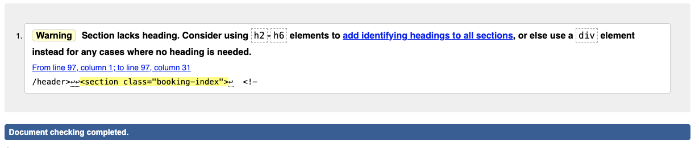 | ⚠️ Notes: See below. |
| registration | [account.html](https://github.com/ssannejohansson/MP3-bark-and-brush/blob/main/my_project/templates/registration/account.html) | [URL](https://validator.w3.org/nu/?doc=https%3A%2F%2Fbark-and-brush-dba8d291cd80.herokuapp.com%2Faccounts%2Faccount%2F) |  | ⚠️ Notes: See below. |
| registration | [login.html](https://github.com/ssannejohansson/MP3-bark-and-brush/blob/main/my_project/templates/registration/login.html) | [URL](https://validator.w3.org/nu/?doc=https%3A%2F%2Fbark-and-brush-dba8d291cd80.herokuapp.com%2Faccounts%2Flogin%2F) |  |  |
| registration | [signup.html](https://github.com/ssannejohansson/MP3-bark-and-brush/blob/main/my_project/templates/registration/signup.html) |[URL](https://validator.w3.org/nu/?doc=https%3A%2F%2Fbark-and-brush-dba8d291cd80.herokuapp.com%2Faccounts%2Fsignup%2F) |  | ⚠️ Notes: See below. |
| registration| [password_reset_complete.html](https://github.com/ssannejohansson/MP3-bark-and-brush/blob/main/my_project/templates/registration/password_reset_complete.html) | [URL](https://validator.w3.org/nu/?doc=https%3A%2F%2Fbark-and-brush-dba8d291cd80.herokuapp.com%2Faccounts%2Freset%2Fdone%2F) |  |  |
| registration | [password_reset_confirm.html](https://github.com/ssannejohansson/MP3-bark-and-brush/blob/main/my_project/templates/registration/password_reset_confirm.html) | [URL](https://validator.w3.org/nu/?doc=https%3A%2F%2Fbark-and-brush-dba8d291cd80.herokuapp.com%2Faccounts%2Freset%2FMQ%2Fset-password%2F) |  |  |
| registration | [password_reset_done.html](https://github.com/ssannejohansson/MP3-bark-and-brush/blob/main/my_project/templates/registration/password_reset_done.html) | [URL](https://validator.w3.org/nu/?doc=https%3A%2F%2Fbark-and-brush-dba8d291cd80.herokuapp.com%2Faccounts%2Fpassword_reset%2Fdone%2F) |  | |
| registration | [password_reset_form.html](https://github.com/ssannejohansson/MP3-bark-and-brush/blob/main/my_project/templates/registration/password_reset_form.html) | [URL](https://validator.w3.org/nu/?doc=https%3A%2F%2Fbark-and-brush-dba8d291cd80.herokuapp.com%2Faccounts%2Fpassword_reset%2F) |  | ⚠️ Notes: See below. |
| my_project | [404.html](https://github.com/ssannejohansson/MP3-bark-and-brush/blob/main/my_project/templates/404.html) | Validated by direct input |  | ⚠️ Notes: See below. |
| my_project | [about.html](https://github.com/ssannejohansson/MP3-bark-and-brush/blob/main/my_project/templates/about.html) | [URL](https://validator.w3.org/nu/?doc=https%3A%2F%2Fbark-and-brush-dba8d291cd80.herokuapp.com%2Fabout%2F)|  | ⚠️ Notes: see below. |
| my_project | [gallery.html](https://github.com/ssannejohansson/MP3-bark-and-brush/blob/main/my_project/templates/gallery.html) | [URL](https://validator.w3.org/nu/?doc=https%3A%2F%2Fbark-and-brush-dba8d291cd80.herokuapp.com%2Fgallery%2F)|  | ⚠️ Notes: see below. |
| my_project | [index.html](https://github.com/ssannejohansson/MP3-bark-and-brush/blob/main/my_project/templates/index.html) | [URL](https://validator.w3.org/nu/?doc=https%3A%2F%2Fbark-and-brush-dba8d291cd80.herokuapp.com%2F) |  | ⚠️ Notes: see below.  |
| my_project | [services.html](https://github.com/ssannejohansson/MP3-bark-and-brush/blob/main/my_project/templates/services.html) | [URL](https://validator.w3.org/nu/?doc=https%3A%2F%2Fbark-and-brush-dba8d291cd80.herokuapp.com%2Fservices%2F) |  | ⚠️ Notes: see below. |

⚠️ Note about Errors with the contact form:

Since the official Django documentation says to wrap forms inside of HTML form tags, I will keep this as it is.

### CSS

I have used the recommended [CSS Jigsaw Validator](https://jigsaw.w3.org/css-validator) to validate all of my CSS files.

| Directory | File | URL | Screenshot | Notes |
| --- | --- | --- | --- | --- |
| my_project | [styles.css](https://github.com/ssannejohansson/MP3-bark-and-brush/blob/main/my_project/static/css/styles.css) | [URL](https://jigsaw.w3.org/css-validator/validator?uri=https%3A%2F%2Fbark-and-brush-dba8d291cd80.herokuapp.com%2F&profile=css3svg&usermedium=all&warning=1&vextwarning=&lang=sv)|  |  |

### JavaScript

I have used the recommended [JShint Validator](https://jshint.com) to validate all of my JS files.

| Directory | File | URL | Screenshot | Notes |
| --- | --- | --- | --- | --- |
| my_project | [script.js](https://github.com/ssannejohansson/MP3-bark-and-brush/blob/main/my_project/static/js/script.js) |  |  | |

### Python

I have used the recommended [PEP8 CI Python Linter](https://pep8ci.herokuapp.com) to validate all of my Python files.

| Directory | File | URL | Screenshot | Notes |
| --- | --- | --- | --- | --- |
| accounts | [admin.py](https://github.com/ssannejohansson/MP3-bark-and-brush/blob/main/accounts/admin.py) | [PEP8 CI Link](https://pep8ci.herokuapp.com/https://raw.githubusercontent.com/ssannejohansson/MP3-bark-and-brush/main/accounts/admin.py) | | ⚠️ Notes: Empty file  |
| accounts | [models.py](https://github.com/ssannejohansson/MP3-bark-and-brush/blob/main/accounts/models.py) | [PEP8 CI Link](https://pep8ci.herokuapp.com/https://raw.githubusercontent.com/ssannejohansson/MP3-bark-and-brush/main/accounts/models.py) | | ⚠️ Notes: Empty file |
| accounts | [tests.py](https://github.com/ssannejohansson/MP3-bark-and-brush/blob/main/accounts/tests.py) | [PEP8 CI Link](https://pep8ci.herokuapp.com/https://raw.githubusercontent.com/ssannejohansson/MP3-bark-and-brush/main/accounts/tests.py) |  | ⚠️ Notes: Empty file |
| accounts | [urls.py](https://github.com/ssannejohansson/MP3-bark-and-brush/blob/main/accounts/urls.py) | [PEP8 CI Link](https://pep8ci.herokuapp.com/https://raw.githubusercontent.com/ssannejohansson/MP3-bark-and-brush/main/accounts/urls.py) |  | |
| accounts | [views.py](https://github.com/ssannejohansson/MP3-bark-and-brush/blob/main/accounts/views.py) | [PEP8 CI Link](https://pep8ci.herokuapp.com/https://raw.githubusercontent.com/ssannejohansson/MP3-bark-and-brush/main/accounts/views.py) |  |  |
| booking | [admin.py](https://github.com/ssannejohansson/MP3-bark-and-brush/blob/main/booking/admin.py) | [PEP8 CI Link](https://pep8ci.herokuapp.com/https://raw.githubusercontent.com/ssannejohansson/MP3-bark-and-brush/main/booking/admin.py) |  | |
| booking | [forms.py](https://github.com/ssannejohansson/MP3-bark-and-brush/blob/main/booking/forms.py) | [PEP8 CI Link](https://pep8ci.herokuapp.com/https://raw.githubusercontent.com/ssannejohansson/MP3-bark-and-brush/main/booking/forms.py) |  |  |
| booking | [models.py](https://github.com/ssannejohansson/MP3-bark-and-brush/blob/main/booking/models.py) | [PEP8 CI Link](https://pep8ci.herokuapp.com/https://raw.githubusercontent.com/ssannejohansson/MP3-bark-and-brush/main/booking/models.py) |  | |
| booking | [tests.py](https://github.com/ssannejohansson/MP3-bark-and-brush/blob/main/booking/tests.py) | [PEP8 CI Link](https://pep8ci.herokuapp.com/https://raw.githubusercontent.com/ssannejohansson/MP3-bark-and-brush/main/booking/tests.py) | | ⚠️ Notes: Empty file |
| booking | [urls.py](https://github.com/ssannejohansson/MP3-bark-and-brush/blob/main/booking/urls.py) | [PEP8 CI Link](https://pep8ci.herokuapp.com/https://raw.githubusercontent.com/ssannejohansson/MP3-bark-and-brush/main/booking/urls.py) |  | |
| booking | [views.py](https://github.com/ssannejohansson/MP3-bark-and-brush/blob/main/booking/views.py) | [PEP8 CI Link](https://pep8ci.herokuapp.com/https://raw.githubusercontent.com/ssannejohansson/MP3-bark-and-brush/main/booking/views.py) |  |  |
| main | [admin.py](https://github.com/ssannejohansson/MP3-bark-and-brush/blob/main/main/admin.py) | [PEP8 CI Link](https://pep8ci.herokuapp.com/https://raw.githubusercontent.com/ssannejohansson/MP3-bark-and-brush/main/main/admin.py) || ⚠️ Notes: Empty file |
| main | [models.py](https://github.com/ssannejohansson/MP3-bark-and-brush/blob/main/main/models.py) | [PEP8 CI Link](https://pep8ci.herokuapp.com/https://raw.githubusercontent.com/ssannejohansson/MP3-bark-and-brush/main/main/models.py) |  | ⚠️ Notes: Empty file |
| main | [tests.py](https://github.com/ssannejohansson/MP3-bark-and-brush/blob/main/main/tests.py) | [PEP8 CI Link](https://pep8ci.herokuapp.com/https://raw.githubusercontent.com/ssannejohansson/MP3-bark-and-brush/main/main/tests.py) |  | ⚠️ Notes: Empty file |
| main | [urls.py](https://github.com/ssannejohansson/MP3-bark-and-brush/blob/main/main/urls.py) | [PEP8 CI Link](https://pep8ci.herokuapp.com/https://raw.githubusercontent.com/ssannejohansson/MP3-bark-and-brush/main/main/urls.py) |  | |
| main | [views.py](https://github.com/ssannejohansson/MP3-bark-and-brush/blob/main/main/views.py) | [PEP8 CI Link](https://pep8ci.herokuapp.com/https://raw.githubusercontent.com/ssannejohansson/MP3-bark-and-brush/main/main/views.py) |  | |
|  | [manage.py](https://github.com/ssannejohansson/MP3-bark-and-brush/blob/main/manage.py) | [PEP8 CI Link](https://pep8ci.herokuapp.com/https://raw.githubusercontent.com/ssannejohansson/MP3-bark-and-brush/main/manage.py) |  |  |
| my_project | [settings.py](https://github.com/ssannejohansson/MP3-bark-and-brush/blob/main/my_project/settings.py) | [PEP8 CI Link](https://pep8ci.herokuapp.com/https://raw.githubusercontent.com/ssannejohansson/MP3-bark-and-brush/main/my_project/settings.py) |  | |
| my_project | [urls.py](https://github.com/ssannejohansson/MP3-bark-and-brush/blob/main/my_project/urls.py) | [PEP8 CI Link](https://pep8ci.herokuapp.com/https://raw.githubusercontent.com/ssannejohansson/MP3-bark-and-brush/main/my_project/urls.py) |  | |
| my_project | [urls.py](https://github.com/ssannejohansson/MP3-bark-and-brush/blob/main/my_project/urls.py) | [PEP8 CI Link](https://pep8ci.herokuapp.com/https://raw.githubusercontent.com/ssannejohansson/MP3-bark-and-brush/main/my_project/urls.py) |  | ⚠️ Notes (if applicable) |
| my_project | [views.py](https://github.com/ssannejohansson/MP3-bark-and-brush/blob/main/my_project/views.py) | [PEP8 CI Link](https://pep8ci.herokuapp.com/https://raw.githubusercontent.com/ssannejohansson/MP3-bark-and-brush/main/my_project/views.py) |  | ⚠️ Notes (if applicable) |

## Responsiveness

I've tested my deployed project to check for responsiveness issues.

| Page | Mobile | Tablet | Desktop | Notes |
| --- | --- | --- | --- | --- |
| Home |  |  |  | Works as expected |
| About |  |  |  | Works as expected |
| Services |  |  |  | Works as expected |
| Gallery |  | 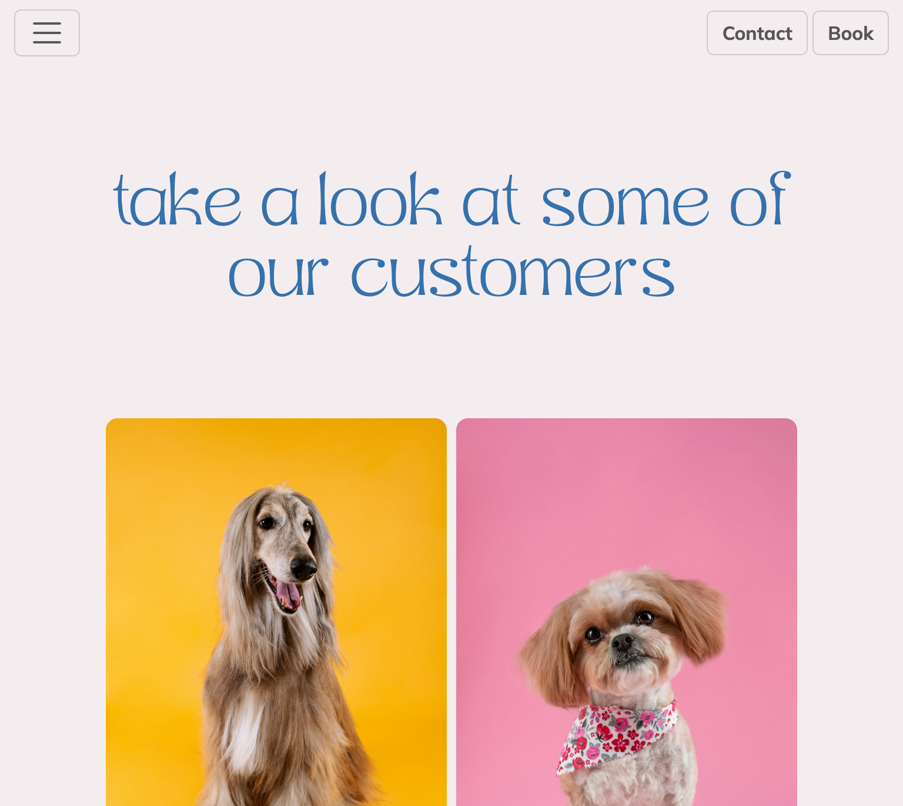 |  | Works as expected |
| 404 |  |  |  | Works as expected |
| Contact Modal |  |  |  | Works as expected |
| Sign Up |  |  |  | Works as expected |
| Log in |  |  |  | Works as expected |account
| Account |  |  |  | Works as expected |
| Book Appointment |  |  |  | Works as expected |
| Appointment Success |  |  |  | Works as expected |
| My Appointments |  |  | 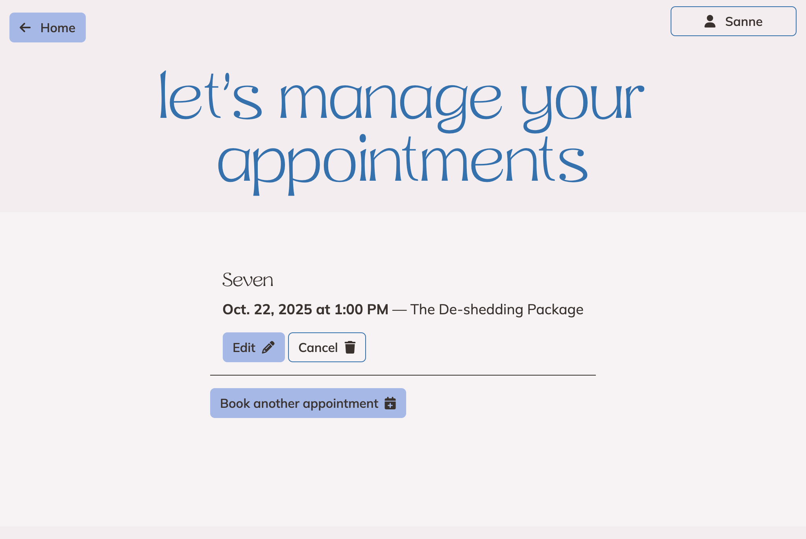 | Works as expected |
| Update Appointment |  |  |  | Works as expected |
| Password Reset |  |  |  | Works as expected |
| Password Reset Complete|  |  |  | Works as expected |
| Password Reset Done |  |  |  | Works as expected |
| Password Reset Form |  |  |  | Works as expected |

## Browser Compatibility

I've tested my deployed project on multiple browsers to check for compatibility issues.

| Page | Chrome | Firefox | Safari | Notes |
| --- | --- | --- | --- | --- |
| Home |  |  |  | Works as expected |
| About |  |  |  | Works as expected |
| Services |  |  |  | Works as expected |
| Gallery |  |  |  | Works as expected |
| 404 |  |  |  | Works as expected |
| Contact Modal |  |  |  | Works as expected |
| Sign Up |  |  |  | Works as expected |
| Log In |  |  |  | Works as expected |
| Account |  |  |  | Works as expected |
| Book Appointment |  | 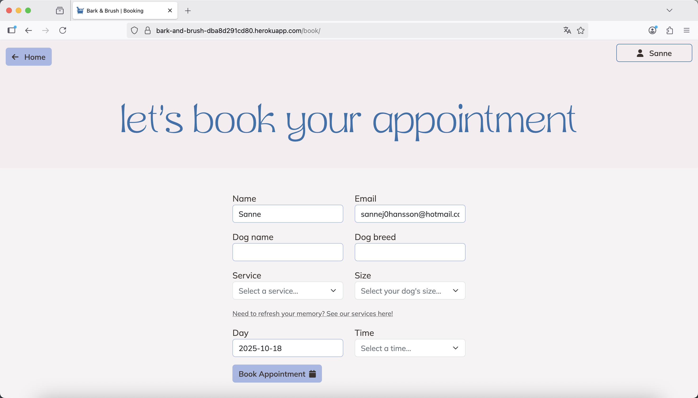 |  | Works as expected |
| Appointment Success |  |  |  | Works as expected |
| My Appointments |  |  |  | Works as expected |
| Update Appointment |  |  |  | Works as expected |
| Password Reset Complete |  |  |  | Works as expected |
| Password Reset Form |  |  |  | Works as expected |
| Password Reset Done |  |  |  | Works as expected |
| Password Reset|  |  |  | Works as expected |

## Lighthouse Audit

⚠️ INSTRUCTIONS ⚠️

I've tested my deployed project using the Lighthouse Audit tool to check for any major issues. Some warnings are outside of my control, and mobile results tend to be lower than desktop.

| Page | Mobile | Desktop |
| --- | --- | --- |
| Home |  |  |
| About |  |  |
| Services | 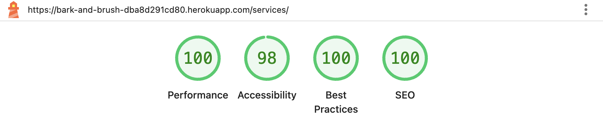 |  |
| Gallery | 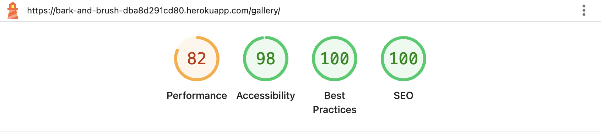 |  |
| Sign Up | 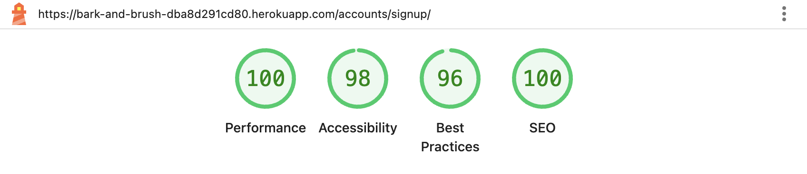 | 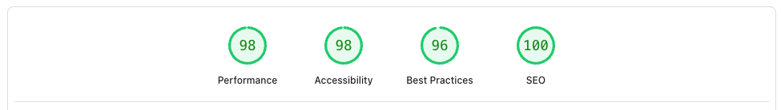 |
| Log In |  | 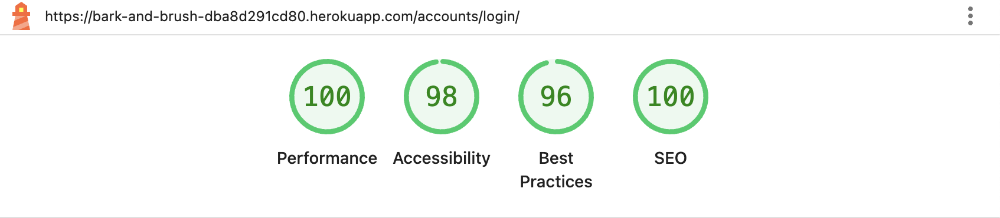 |
| Account |  | 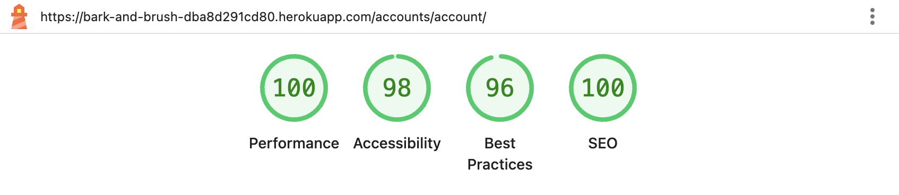 |
| Book Appointment |  |  |
| Appointment Success |  |  |
| My Appointments |  |  |
| Update Appointment |  |  |
| Password Reset Complete |  |  |
| Password Reset Confirm |  |  |
| Password Reset Done | 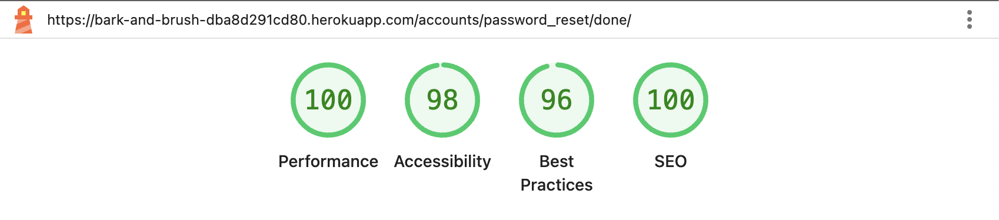 |  |
| Password Reset Form |  |  |

⚠️ NOTES: 
The lower performance scores on certain pages are primarily attributed to image sizes, despite having already been compressed. Compressing them further with free compressors is making them loose quality and look bad. Given the website’s relatively small scale, I therefore chose to leave them as they are for now. However, I recognize that in a real-world or larger-scale project with more images, further optimization and compression would be necessary to enhance performance.py

## Defensive Programming

Defensive programming was manually tested with the below user acceptance testing:

| Page | Expectation | Test | Result | Screenshot |
| --- | --- | --- | --- | --- |
| Business Owner Management | Feature is expected to allow the business owner to create new bookings | Created a new booking | Booking was created successfully and displayed correctly in the booking system. |  |
| | Feature is expected to allow the business owner to update existing booking | Edited the content of an existing booking | Booking was updated successfully with the new content. |  |
| | Feature is expected to allow the business owner to delete bookings| Attempted to delete a booking, confirming the action before proceeding | Booking was deleted successfully. |  |
| | Feature is expected to retrieve a list of all booked appointments | Accessed the business owner dashboard to view all booked appointments | All booked appointments were displayed in a list view. |  |
| User Authentication | Feature is expected to allow registered users to log in to the site. | Attempted to log in with valid and invalid credentials. | Login was successful with valid credentials; invalid credentials were rejected. |  |
| | Feature is expected to allow users to register for an account. | Registered a new user with unique credentials. | User account was created successfully. |  |
| | Feature is expected to allow users to log out securely. | Logged out and tried accessing a restricted page. | Access was denied after logout, as expected. |  |
| User Booking | Feature is expected to allow registered users to book an appointment | Logged in and booked an appointment | Occupied time slots was grayed out and disabled |  |
| Prevent Double Booking | Feature is expected to disable already booked time slots to prevent double booking | Logged in and booked an appointment |  |  |
| | Feature is expected to allow registered users to manage their appointments | Updated a booked appointment, canceled a booked appointment | Booked appointment got updated/canceled and notification was displayed as expected. |  [screenshot](documentation/defensive/cancel.png)|
| | Feature is expected to allow users to edit their account information | Edited account information | Changes was applied |  |
| Other Features | Guest and registered users are able to fill in a contact form to contact the business | Filled in the contact form and clicked "Send Message" | Both guest users and registered users are able to send a message |    ||

## User Story Testing

| Target | Expectation | Outcome | Screenshot |
| --- | --- | --- | --- |
| As a business owner|  I would like a responsive site with clear navigation that clearly communicates our services | so that our customers will stay on our site |  |
| As a business owner | I would like to have an admin site | so that I can manage bookings and users |  |
| As a first time visitor | I would like to find a groomer | so that I can groom my dog | |
| As first time visitor | I would like to know more about the groomers | so that I know if they will go along with my dog | 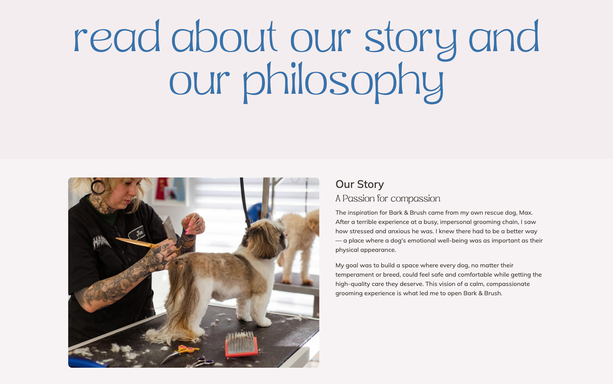 |
| As a first time visitor | I would like to know what services the groomers provide | so that I know if they will meet my requirements |  |
| As a first time visitor | I would like to look at images of previous customers | so that I can decide if I like their services |  |
| As a first time visitor | I would like to book an appointment | so that I can get my dog groomed |  |
| As a first time visitor | I would like to know the opening times | so that I can know if they suit me | |
| As a returning customer | I would like to book an appointment | so that I can get my dog groomed | |
| As a returning customer | I would like to get in touch with the groomers | so that I can ask potential questions | 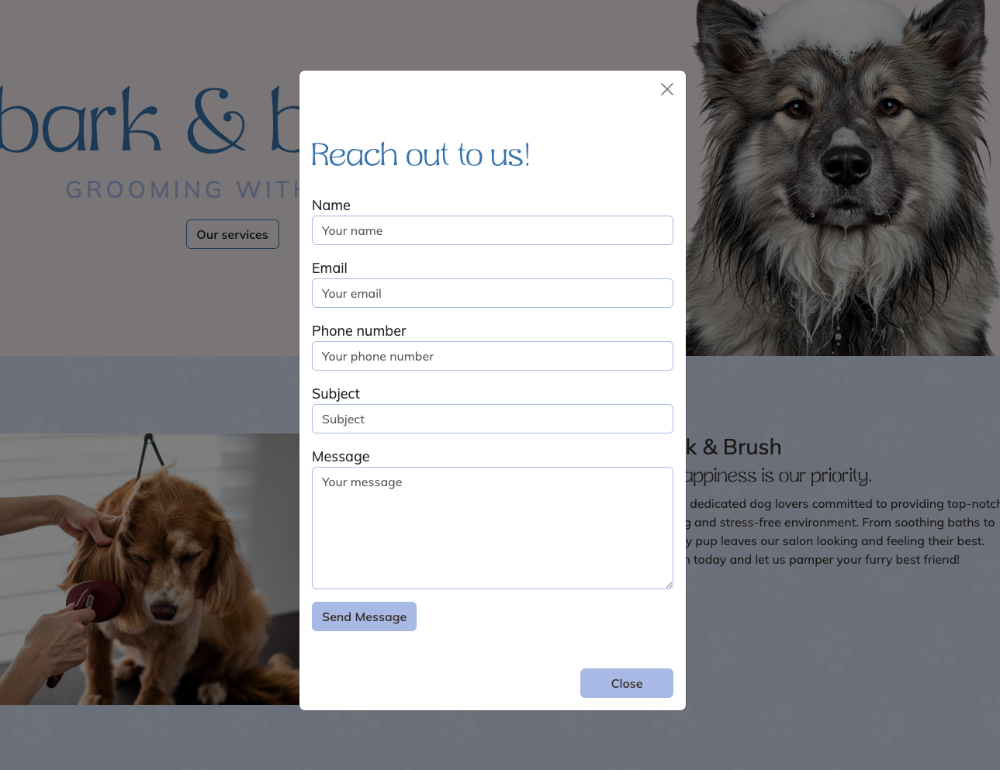 |
| As a returning customer | I would like to sign up for a newsletter | so that I can get all the news from the business |  |
| As a frequent customer | I would like to book an appointment | so that I can get my dog groomed |  |

## Additional testing

In addition to conducting my own testing, I shared the website with friends and family to ensure compatibility across various devices and operating systems. I also requested their feedback on the overall user flow to confirm that the site is intuitive, easy to understand, feels authentic and are simple to navigate for all users.

## Bugs

### Fixed Bugs

I've used [GitHub Issues](https://www.github.com/ssannejohansson/MP3-bark-and-brush/issues) to track and manage bugs and issues during the development stages of my project.

All previously closed/fixed bugs can be tracked [here](https://www.github.com/ssannejohansson/MP3-bark-and-brush/issues?q=is%3Aissue+is%3Aclosed+label%3Abug).

### Unfixed Bugs

### Known Issues

| Issue | Screenshot |
| --- | --- |
| When validating HTML with a semantic `<section>` element, the validator warns about lacking a header `h2-h6`. This is acceptable. |  |

> [!IMPORTANT]  
> There are no remaining bugs that I am aware of, though, even after thorough testing, I cannot rule out the possibility.

